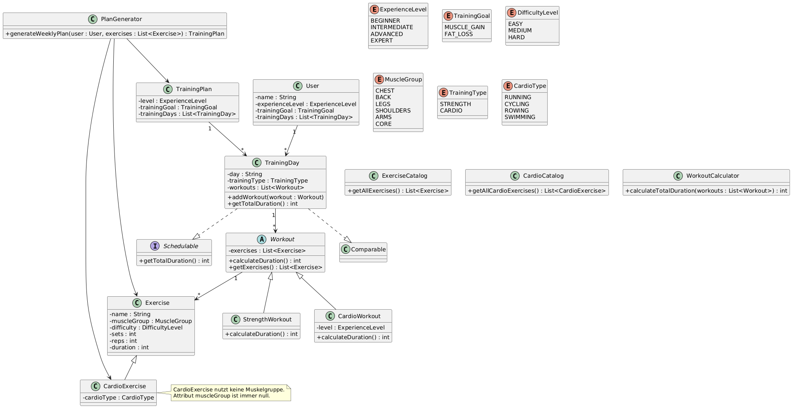

# Trainingsplan-Generator (PStA OOP)

- **Name:** Jonas Max, Kirchenbaur
- **Matrikelnummer:** 1082584
- **Projekttitel:** Trainingsplan-Generator

---

## Projektbeschreibung und Projektidee
Ziel des Projekts ist die automatische Erstellung eines Trainingsplans.
Basierend auf dem **Erfahrungslevel** und dem **Trainingsziel** eines Benutzers
wird automatisch ein **Wochen-Trainingsplan** erstellt.

Bei der Generierung des Trainingsplans wird zwischen **Krafttraining** und **Kardiotraining** unterschieden. 
Dabei werden realistische Trainingsregeln umgesetzt,
wie z.B. die Trennung von Kardio- und Krafttraining an einem Trainingstag
sowie feste trainingsfreie Tage ("Rest Days").

Die Auswahl der **Kraftübungen** erfolgt abhängig vom Erfahrungslevel des
Benutzers. Dabei werden nur Übungen berücksichtigt, deren Schwierigkeitsgrad
für das jeweilige Level geeignet ist. Zusätzlich wird die Anzahl der Übungen
pro Muskelgruppe an das Erfahrungslevel angepasst, sodass Anfänger weniger
und fortgeschrittene Benutzer mehr Übungen pro Trainingstag erhalten.

Auch die **Dauer der Kardio-Workouts** richtet sich nach dem Erfahrungslevel
des Benutzers. Je höher das Erfahrungslevel, desto länger fällt die
Kardio-Trainingseinheit aus.

Das Projekt dient dazu, die in der Vorlesung behandelten Konzepte der
objektorientierten Programmierung praktisch anzuwenden.

---

## Anwendungsfall
Ein Benutzer (z.B. ein Fitnessstudio-Mitglied) gibt sein Erfahrungslevel
(Anfänger, Fortgeschritten, Experte) sowie sein Trainingsziel
(Muskelaufbau oder Fettabbau) an.

Die Software erzeugt daraufhin automatisch:
- einen Trainingsplan für **7 Tage**
- Trainingstage mit **Kraft- oder Kardioworkouts**
- feste **Rest Days**
- eine sinnvolle Verteilung der Trainingseinheiten über die Woche

Der erzeugte Trainingsplan wird über die Konsole ausgegeben.
Es findet **keine Benutzereingabe** statt.

---

## Technische Umsetzung

### Vererbung
- Die abstrakte Klasse `Workout` bildet die gemeinsame Basisklasse aller Workouts.
- Die Klassen `StrengthWorkout` und `CardioWorkout` erben von `Workout`
  und implementieren jeweils eine eigene Berechnung der Trainingsdauer.

### Abstrakte Klasse
- `Workout` ist als abstrakte Klasse umgesetzt und erzwingt die Implementierung
  der Methode `calculateDuration()` in allen Unterklassen.

### Interface
- Das Interface `Schedulable` definiert die Methode `getTotalDuration()`.
- Es wird von der Klasse `TrainingDay` implementiert.

### Polymorphie
- Die Methode `calculateDuration()` wird polymorph verwendet, z.B. in der
  Klasse `TrainingDay`, wobei abhängig vom konkreten Workout-Typ
  (`StrengthWorkout` oder `CardioWorkout`) die passende Implementierung
  aufgerufen wird.

### Exceptions
- In der Klasse `TrainingDay` wird eine `IllegalStateException` geworfen,
  wenn versucht wird, Kardio- und Krafttraining an einem Trainingstag zu mischen.
- In der Klasse `CardioWorkout` wird eine `IllegalArgumentException` geworfen,
  wenn ein Kardio-Workout nicht genau eine Übung enthält.

### Collections
- Das Java Collection Framework wird an mehreren Stellen eingesetzt:
    - `List<Exercise>` für Übungen
    - `List<Workout>` für Trainingseinheiten
    - `List<TrainingDay>` für den Wochen-Trainingsplan
    - `Set<String>` für feste Rest Days
- Zusätzlich werden Methoden wie `Collections.shuffle()` und
  `Collections.sort()` verwendet.

### Comparable / Sortierung
- Die Klasse `TrainingDay` implementiert das Interface `Comparable<TrainingDay>`.
- Trainingstage können anhand ihrer **Gesamtdauer** verglichen und sortiert werden.
- Die Sortierung wird im Anwendungscode demonstriert, indem die Trainingstage
  eines erzeugten Trainingsplans nach ihrer Belastung sortiert ausgegeben werden.

### equals() und toString()
- Die Methoden `equals()` und `hashCode()` wurden sinnvoll implementiert:
    - in der Klasse `Exercise` (Vergleich nach Name, Muskelgruppe und Schwierigkeit)
    - in der Klasse `User` (Vergleich anhand des Namens)
- Zusätzlich wurden aussagekräftige `toString()`-Methoden implementiert.

### JUnit-Tests
Zur Qualitätssicherung wurden drei sinnvolle JUnit-Tests implementiert:
1. `TrainingDayTest`  
   Testet, dass ein Trainingstag nicht Kardio- und Krafttraining mischen darf
   (Exception-Test).
2. `CardioWorkoutDurationTest`  
   Testet, dass die Dauer eines Kardio-Workouts vom Erfahrungslevel abhängt
   (Nachweis von Polymorphie).
3. `TrainingPlanGenerationTest`  
   Testet, dass der `PlanGenerator` immer einen vollständigen Wochenplan
   mit genau 7 Trainingstagen erzeugt.

Alle Tests befinden sich im Verzeichnis `src/test/java`.

---

## UML-Klassendiagramm
Das folgende UML-Klassendiagramm zeigt die Struktur des Projekts inklusive
Vererbungsbeziehungen, abstrakter Klassen, Interfaces sowie der Beziehungen
zwischen Modell- und Logikklassen.

---

## Start des Programms
Das Programm wird über die Klasse `App` gestartet.
Dort werden Beispielobjekte erzeugt und die Funktionalität des Projekts
demonstriert.

Es gibt **keine Benutzereingabe** und **keine GUI**.
